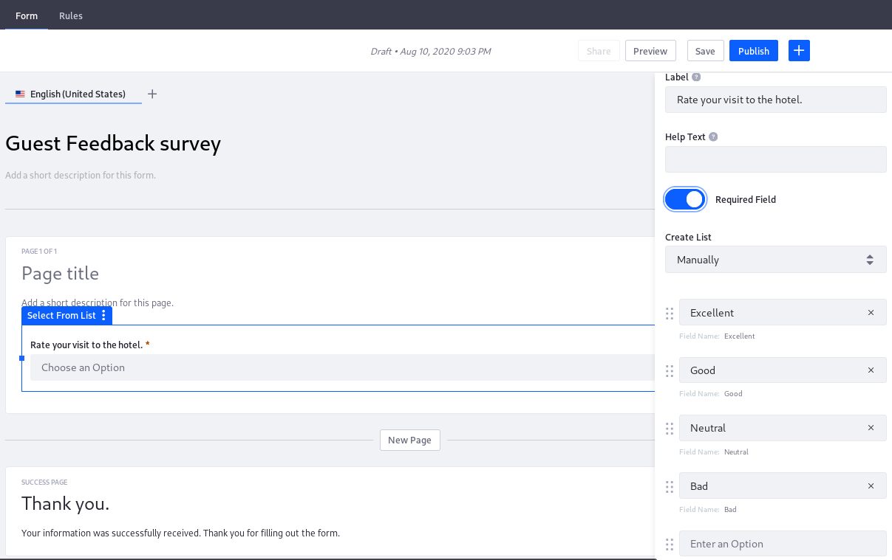
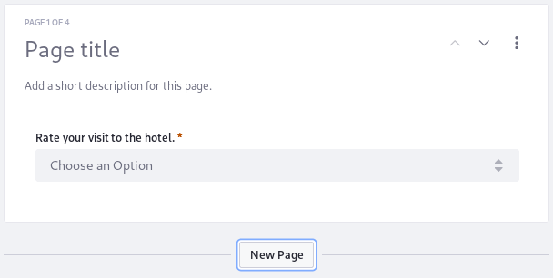

# Creating Forms

The _Forms_ application allows users to create multi-field forms. Only authenticated users with the requisite [Process Automation Permissions](./forms-permissions-reference.md) have the ability to create forms. (At minimum, they should have the ability to access the _Site Administration_ menu and the _Forms_ application.) To learn more about DXP Roles and Permissions, see [Roles and Permissions](../../../users-and-permissions/roles_and_permissions.rst).


## Building a Form

The sample below is a hotel guest feedback survey form.

1. Open the _Product Menu_ () then click the compass icon () on the _Site Administration_ menu. Select the site where the form will be created.
1. Click _Content & Data_  &rarr; _Forms_.
1. Click the _Add_ button (). The form builder view appears.
1. Enter a name for the form: **Guest Feedback Survey**.
1. Enter a short description.
1. Enter a page name. Otherwise it will use the default value: _Untitled Page (1 of X)_.
1. Click the _Add_ button () to display the _Add Elements_ sidebar (if it is not already opened).

    

1. Drag a _Select from List_ field onto the form builder.
1. Enter the following values:

    * **Label**: _Rate your visit to the hotel._
    * **Help Text**: Leave this blank for now. If you want a subheading for your field to provide additional guidance, this would be useful.
    * Switch the Toggle to _YES_ in the **Required Field** selector.
    * Leave the manual option checked for creating-forms the list of selections. To learn about populating the field with a data provider, read the [Data Providers](./advanced-forms-usage/using-data-providers-to-populate-form-options.md) article.

1. In the _Options_ section, enter the values for the survey question:

    * **Excellent**
    * **Good**
    * **Neutral**
    * **Bad**

    ```note::
       Typing in one of the fields automatically adds another blank selection line. Just leave the last one blank when you're done.
    ```

    

1. To add additional elements such as a text field, drag and drop the _Text Field_ element underneath the _Select from List_ element.
1. In the _Text Field_'s _Basic_ tab, enter the following:

    * **Label**: *Comments*
    * **Help Text**: Leave this blank.
    * **Field Type**: Click the _Multiple Lines_ radio button to allow longer comments.
    * **Required Field:** Leave the toggle to _NO_.

1. Close the sidebar.
1. Click _Save Form_ to save the form as a draft.

### Adding Form Pages

If you decide multiple pages are appropriate for your form, Liferay Forms supports multi-page forms.

To add Form Pages,

1. Navigate to the form builder view.
1. Click the _New Page_ button at the bottom of the first Form Page.

    

1. New Form Pages are appended to the bottom of the Form Builder (but before the Success Page).
1. Enter a page name.
1. Drag and drop additional elements.
1. Add even more pages if necessary.

### Adding a Success Page

The _Success Page_ provides resolution for Form users, by letting them know they have reached the end of form and that the form has been successfully submitted.

The default Success Page is handy:


If you don't want a Success Page, click the Actions () button on the default success page and choose _Remove Success Page_.

To customize the Success Page,

1. Click the Title field (_Thank You_ by default) and use the editor box.
1. Click the Message field (_Your information was..._ by default) and use the editor to customize the success message.


### Publishing a Form

Once you have completed your form, you must publish it before users can begin submitting responses. Click the _Publish Form_ to publish.

When you publish a form, a URL is generated that can be sent to users to fill out the form.


See [Sharing Forms](./sharing-forms.md) to learn more.

## Duplicating a Form

Forms can be duplicated in order to create similar forms without having to create one from scratch. To duplicate a form follow these steps:

1. Navigate to _Site Administration_ &rarr; _Content & Data_ &rarr; _Forms_.
1. Click the _Actions_ button () next to the original form.

    

1. Click _Duplicate_.

This generates a copy of the original survey form. Users can begin modifying the duplicate form.


## What's Next

* [Sharing Forms](./sharing-forms.md)
* [Managing Form Entries](./managing-form-entries.md)
* [Validating Text and Numeric Field Entries](./advanced-forms-usage/validating-text-and-numeric-field-entries.md)
* [Enabling CAPTCHA on Form Submissions](./advanced-forms-usage/enabling-captcha-on-form-submissions.md)
